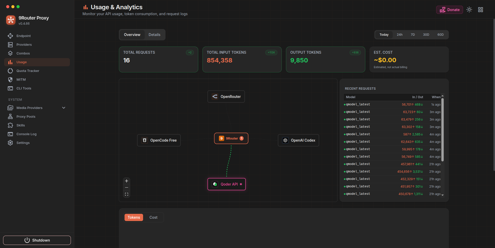

# Real-Time Usage Stats dengan SSE dan Debounce



## Overview

Fitur ini menyediakan pembaruan statistik penggunaan secara real-time menggunakan Server-Sent Events (SSE) dengan mekanisme debounce untuk mengoptimalkan performa. Statistik yang ditampilkan meliputi total requests, input tokens, output tokens, dan estimasi biaya dengan animasi transisi yang smooth.

## Arsitektur

### Komponen Utama

```
┌─────────────────────────────────────────────────────────────┐
│                    UsageStats.js                             │
│  - Mengelola koneksi SSE ke /api/usage/stream               │
│  - Debounce refresh stats (500ms)                           │
│  - Request sequence guard untuk mencegah race condition     │
│  - Pass summaryPulse ke OverviewCards                       │
└─────────────────────────────────────────────────────────────┘
                            │
                            ▼
┌─────────────────────────────────────────────────────────────┐
│                  OverviewCards.js                            │
│  - AnimatedMetricCard untuk setiap metrik                   │
│  - AnimatedMetricValue dengan ease-out cubic animation      │
│  - DeltaBadge untuk menampilkan perubahan nilai             │
│  - Highlight effect saat nilai berubah                      │
└─────────────────────────────────────────────────────────────┘
                            │
                            ▼
┌─────────────────────────────────────────────────────────────┐
│              usageRealtime.js (Shared Utilities)             │
│  - prefersReducedMotion()                                   │
│  - formatCompactDelta()                                     │
│  - formatSignedDelta()                                      │
│  - calculateEasedProgress()                                 │
│  - interpolateValue()                                       │
│  - shouldTriggerDelta()                                     │
│  - calculateDelta()                                         │
│  - createRequestSequenceGuard()                             │
│  - createDebounceTimer()                                    │
└─────────────────────────────────────────────────────────────┘
```

## Cara Kerja

### 1. Server-Sent Events (SSE)

Klien membuka koneksi SSE ke `/api/usage/stream` untuk menerima update real-time:

```javascript
const es = new EventSource("/api/usage/stream");

es.onmessage = (e) => {
  const data = JSON.parse(e.data);
  // Update activeRequests, recentRequests, errorProvider, pending
  scheduleRealtimeStatsRefresh(); // Trigger debounced refresh
};
```

**Keuntungan SSE:**
- Koneksi persisten, tidak perlu polling
- Server push, latency rendah
- Auto-reconnect built-in

### 2. Debounce Mechanism

Untuk mencegah request flood saat SSE events burst, digunakan debounce 500ms:

```javascript
const scheduleRealtimeStatsRefresh = useCallback(() => {
  realtimeStatsTimer.current.schedule(() => {
    // Fetch fresh stats dari /api/usage/stats
    // Set summaryPulse = Date.now() untuk trigger animasi
  }, 500);
}, [period]);
```

**Flow:**
1. SSE event diterima → schedule debounced refresh
2. Jika event lain datang dalam 500ms → reset timer
3. Setelah 500ms tanpa event → fetch stats baru
4. Set `summaryPulse` timestamp untuk trigger animasi

### 3. Request Sequence Guard

Mencegah race condition saat multiple requests berjalan:

```javascript
const statsRequestSeq = useRef(createRequestSequenceGuard());

// Saat fetch dimulai
const requestId = statsRequestSeq.current.next();

// Saat response diterima
if (statsRequestSeq.current.isValid(requestId)) {
  // Update state hanya jika ini request terbaru
}
```

**Contoh scenario:**
- Request A dimulai (id=1)
- User ganti period → Request B dimulai (id=2)
- Request A selesai → **ignored** (id=1 tidak valid, current=2)
- Request B selesai → **applied** (id=2 valid)

### 4. Animated Metrics

#### Ease-Out Cubic Animation

Animasi transisi nilai menggunakan ease-out cubic untuk efek natural:

```javascript
const calculateEasedProgress = (progress) => {
  const clamped = Math.min(1, progress);
  return 1 - Math.pow(1 - clamped, 3);
};
```

**Karakteristik:**
- Durasi: 450ms
- Start cepat, slow down di akhir
- Respects `prefers-reduced-motion` accessibility setting

#### Delta Badge

Menampilkan perubahan nilai dengan badge hijau:

```javascript
const shouldTriggerDelta = (pulseKey, previousValue, currentValue) => {
  return !!(pulseKey && previousValue !== currentValue);
};

const calculateDelta = (previousValue, currentValue) => {
  return currentValue - previousValue;
};
```

**Behavior:**
- Badge muncul saat nilai berubah
- Auto-hide setelah 1800ms
- Format compact untuk angka besar (1.5K, 2.3M)

#### Highlight Effect

Card mendapat highlight glow saat nilai berubah:

```javascript
useEffect(() => {
  if (!shouldTriggerDelta(pulseKey, previous, currentValue)) return;
  
  setDelta(calculateDelta(previous, currentValue));
  setHighlighted(true);
  
  // Clear setelah timeout
  setTimeout(() => setDelta(0), 1800);
  setTimeout(() => setHighlighted(false), 900);
}, [pulseKey, value]);
```

## Utility Functions

### `prefersReducedMotion()`

Mengecek apakah user mengaktifkan reduced motion di OS settings.

```javascript
if (prefersReducedMotion()) {
  // Skip animasi, langsung set nilai final
}
```

### `formatCompactDelta(value)`

Format angka dengan suffix K (ribu) atau M (juta):

```javascript
formatCompactDelta(500)      // "500"
formatCompactDelta(1500)     // "1.5K"
formatCompactDelta(1500000)  // "1.5M"
```

### `formatSignedDelta(value, formatter)`

Format delta dengan tanda + atau −:

```javascript
formatSignedDelta(100, fmt)   // "+100"
formatSignedDelta(-100, fmt)  // "−100"
```

### `createRequestSequenceGuard()`

Factory untuk request sequence validator:

```javascript
const guard = createRequestSequenceGuard();
const id1 = guard.next();        // 1
const id2 = guard.next();        // 2
guard.isValid(id1);              // false (sudah ada yang lebih baru)
guard.isValid(id2);              // true
```

### `createDebounceTimer()`

Factory untuk debounce timer dengan cleanup:

```javascript
const timer = createDebounceTimer();
timer.schedule(callback, 500);   // Schedule dengan delay 500ms
timer.clear();                   // Cancel pending callback
timer.isActive();                // Check apakah ada pending callback
```

## Testing

Test suite mencakup 76 test cases dengan coverage:

- **prefersReducedMotion**: 5 tests
- **formatCompactDelta**: 11 tests
- **formatSignedDelta**: 8 tests
- **calculateEasedProgress**: 7 tests
- **interpolateValue**: 7 tests
- **shouldTriggerDelta**: 7 tests
- **calculateDelta**: 6 tests
- **createRequestSequenceGuard**: 7 tests
- **createDebounceTimer**: 10 tests
- **Constants**: 8 tests

**Run tests:**
```bash
cd tests
npm test -- unit/usage-realtime.test.js
```

## Konstanta

```javascript
// Animation
METRIC_ANIMATION_DURATION_MS = 450
DELTA_CLEAR_TIMEOUT_MS = 1800
HIGHLIGHT_CLEAR_TIMEOUT_MS = 900

// Formatting thresholds
COMPACT_THOUSAND = 1000
COMPACT_MILLION = 1000000
COMPACT_THOUSAND_DECIMAL_CUTOFF = 10000
COMPACT_MILLION_DECIMAL_CUTOFF = 10000000

// Realtime
REALTIME_STATS_REFRESH_DEBOUNCE_MS = 500
STATS_REQUEST_SEQUENCE_STEP = 1
```

## Performance Considerations

### Optimizations

1. **Debounce**: Mencegah request flood saat SSE burst
2. **Request sequence guard**: Mencegah race condition dan stale data
3. **Ref-based scheduling**: SSE connection tidak reconnect saat period berubah
4. **Reduced motion support**: Skip animasi untuk accessibility
5. **Compact formatting**: Angka besar lebih readable (1.5K vs 1500)

### Memory Management

- Timer cleanup di useEffect return
- EventSource close saat unmount
- CancelAnimationFrame untuk animasi
- ClearTimeout untuk semua pending timers

## Accessibility

Fitur ini respects user preferences:

```javascript
if (prefersReducedMotion()) {
  // Langsung set nilai final tanpa animasi
  setDisplayValue(to);
  return;
}
```

User dengan `prefers-reduced-motion: reduce` di OS settings akan melihat update instan tanpa animasi.

## Troubleshooting

### SSE tidak connect

**Symptom:** Stats tidak update real-time

**Solution:**
1. Check apakah `/api/usage/stream` endpoint available
2. Check browser console untuk error
3. Verify tidak ada firewall/proxy blocking SSE

### Animasi tidak smooth

**Symptom:** Animasi patah-patah atau lag

**Solution:**
1. Check apakah ada heavy rendering di parent component
2. Verify `requestAnimationFrame` digunakan (bukan setTimeout)
3. Consider reduce animation duration jika device low-end

### Race condition

**Symptom:** Stats lama overwrite stats baru

**Solution:**
1. Verify `createRequestSequenceGuard` digunakan
2. Check `isValid(requestId)` sebelum update state
3. Pastikan sequence increment setiap request baru

## Related Files

- `src/shared/components/UsageStats.js` - Main component
- `src/app/(dashboard)/dashboard/usage/components/OverviewCards.js` - Animated cards
- `src/shared/utils/usageRealtime.js` - Shared utilities
- `tests/unit/usage-realtime.test.js` - Test suite
- `src/app/api/usage/stream/route.js` - SSE endpoint (server-side)
- `src/app/api/usage/stats/route.js` - REST endpoint (server-side)

## Changelog

### 2026-06-05

- Initial implementation
- SSE real-time updates dengan debounce 500ms
- Animated metrics dengan ease-out cubic
- Delta badges dan highlight effects
- Request sequence guard untuk race condition prevention
- Accessibility support (prefers-reduced-motion)
- 76 unit tests dengan comprehensive coverage
